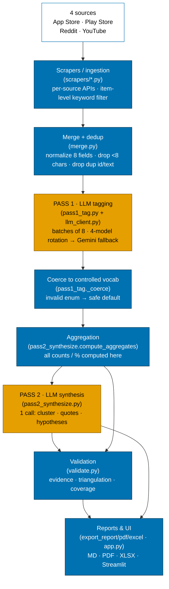

# Artifact 1 — Pipeline Architecture ("How it works" 1-slider)

Full flow from four public sources to the final report. **Blue = deterministic
Python code. Orange = LLM.** Standalone slide-ready version: `01_architecture.svg`.

Every stage below maps to a real file in the repo (named in brackets).

## Mermaid

## Stage-by-stage: deterministic vs LLM

| # | Stage | File | Type | What it does |
|---|-------|------|------|--------------|
| 1 | Sources | — | input | App Store, Play Store, Reddit, YouTube (Trustpilot/MouthShut probed & dropped) |
| 2 | Scrapers | `scrapers/*.py` | **code** | Per-source public API/feed; item-level keyword filter; dedup by id; pagination-stall abort |
| 3 | Merge + dedup | `merge.py` | **code** | Normalize to 8 fields; drop <8-char and duplicate text |
| 4 | Pass 1 tagging | `pass1_tag.py` + `llm_client.py` | **LLM** | Per-item structured JSON; batches of 8; 4-model Groq rotation then Gemini |
| 5 | Coercion | `pass1_tag._coerce` | **code** | Force every field into the controlled vocab; invalid → safe default |
| 6 | Aggregation | `pass2_synthesize.compute_aggregates` | **code** | **All** frequencies, %s, evidence counts computed deterministically |
| 7 | Pass 2 synthesis | `pass2_synthesize.py` | **LLM** | ONE call: cluster JTBDs, pick quotes, write hypotheses (tagged with supporting themes) |
| 8 | Validation | `validate.py` | **code** | Evidence depth, triangulation, coverage/ambiguity, 30-item human sample |
| 9 | Reports & UI | `export_*.py`, `app.py` | **code** | Markdown, PDF (charts), XLSX, Streamlit dashboard |

**Design invariant (verifiable in code):** the LLM is used at only two stages
(4 and 7). Every number that appears in a report is computed in Python (stages 6
and 8), so counts and percentages cannot be hallucinated — the LLM's role at
stage 7 is limited to language tasks (clustering, quote selection, hypothesis
wording), and each hypothesis it writes must cite controlled-vocab themes whose
evidence is then counted deterministically.
