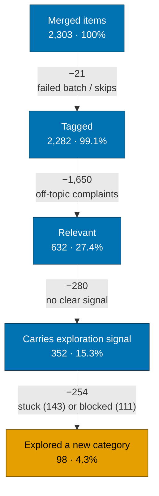

# Artifact 5 — The Funnel, stage by stage

Where the 2,303 merged items go. Numbers are from `data/synthesis.json` (`funnel`)
and `data/validation.json`. Slide-ready visual: `05_funnel.svg`.

## The numbers (exact, from the run)

| Stage | Count | % of merged | Drop from previous | What causes the drop |
|-------|------:|------:|------:|----------------------|
| Merged items | 2,303 | 100.0% | — | (baseline after scrape + dedup) |
| Tagged | 2,282 | 99.1% | −21 | 1 failed LLM batch (8 items) + ~13 id mismatches/skips; resumable, not re-run |
| Relevant (on-topic) | 632 | 27.4% | −1,650 | `is_relevant=false`: pure delivery/app/refund complaints with no category-exploration bearing |
| Carries exploration signal | 352 | 15.3% | −280 | relevant to category behaviour but `exploration_signal=no_signal` (no clear explore/stuck cue) |
| Explored a new category | 98 | 4.3% | −254 | the 254 that carry signal are `stuck_in_routine` (143) or `wants_to_explore_but_blocked` (111) — signal present, but no actual crossover |

> The last three stages are the product story: **1,650 items are noise** (correctly
> filtered), **352 of 632 relevant items carry a directional signal**, and only **98
> people actually crossed into a new category** — the rest are stuck or blocked.

## Mermaid (flow with drops)

**Reading note for the slide:** the big drop (Tagged → Relevant, −1,650) is the
signal-to-noise filter working as intended — see Artifact 8 on why an 84.6%
no-signal rate is expected. The final 98 "explored" is the numerator for the
strategic metric the brief targets (% of MACs buying a new category).
